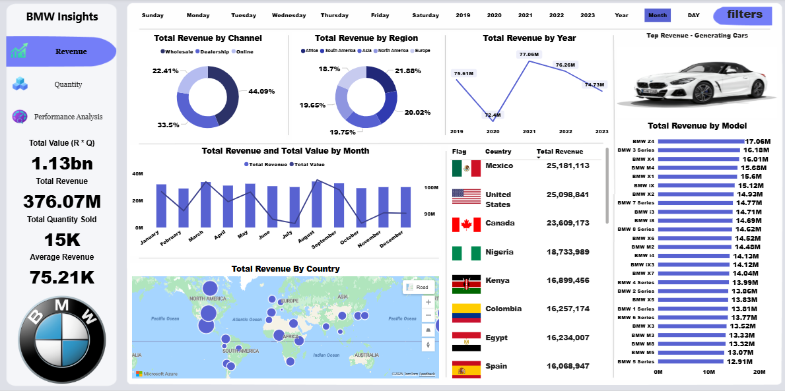
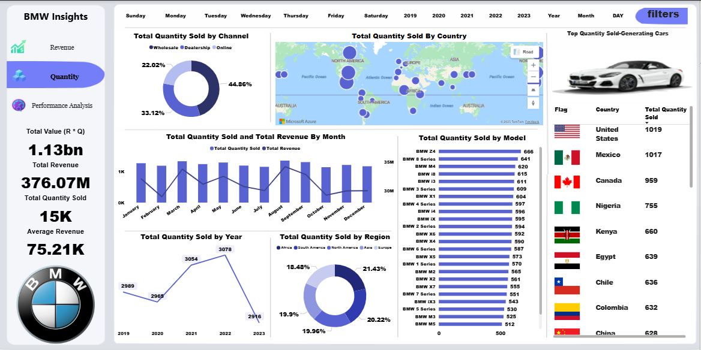
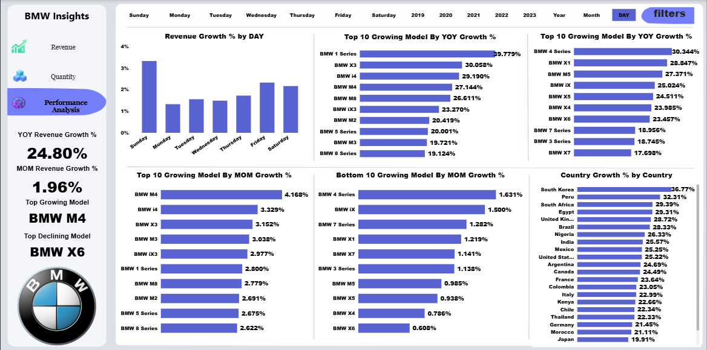

# 🚗 BMW Sales Analysis — SQL & Power BI
A complete end‑to‑end analytical project using **SQL**, **Power BI**, and **data modeling best practices**. This repository contains all source code, queries, visuals, and dashboards used to build insights about BMW sales performance.

---

## 📁 Repository Structure
```
BMW_SALES_Analysis_With_SQL_And_Power-BI/
│
├── dataset/               # Raw and cleaned data files
├── sql/                   # SQL scripts for cleaning, transforming, and querying data
├── powerbi/               # Power BI file (.pbix) and custom theme
├── images/                # Dashboard screenshots & visuals
└── README.md              # Project documentation
```

---

## 🎯 Project Objectives
- Analyze BMW sales performance across models, years, and regions.
- Identify **top‑selling models**, **seasonal trends**, and **market behavior**.
- Create professional Power BI dashboards with interactive visuals.
- Use **SQL** for data cleaning, transformation, and advanced KPIs.

---

## 🛢️ SQL Processing
All transformations were completed using SQL before loading into Power BI.

### 🔹 Example: Creating the Cleaned Sales Table
```sql
SELECT
    s.SaleID,
    s.SaleDate,
    s.Model,
    s.EngineType,
    s.Transmission,
    s.Color,
    s.Price,
    s.Quantity,
    (s.Price * s.Quantity) AS TotalRevenue,
    c.Country,
    c.Dealer
FROM Sales AS s
JOIN Customers AS c
    ON s.CustomerID = c.CustomerID;
```

### 🔹 Example KPI: Year‑over‑Year Growth
```sql
SELECT
    YEAR(SaleDate) AS Year,
    SUM(TotalRevenue) AS Revenue,
    LAG(SUM(TotalRevenue)) OVER (ORDER BY YEAR(SaleDate)) AS PrevYearRevenue,
    (SUM(TotalRevenue) - LAG(SUM(TotalRevenue)) OVER (ORDER BY YEAR(SaleDate)))
        / NULLIF(LAG(SUM(TotalRevenue)) OVER (ORDER BY YEAR(SaleDate)), 0) * 100
        AS YoYGrowth
FROM CleanedSales
GROUP BY YEAR(SaleDate)
ORDER BY Year;
```

---

## 📊 Power BI Components
The dashboard includes:
- **Overview Page**: Total Sales, Revenue, Units Sold, Top Models
- **Model Performance**: Model comparison, price segments, drivetrain analysis
- **Geographical Insights**: Sales distribution by region/country
- **Trends Page**: YoY, MoM performance, forecasting

### 🔹 Example DAX Measures
**Total Revenue**
```DAX
Total Revenue = SUM(CleanedSales[TotalRevenue])
```

**Year‑over‑Year Growth**
```DAX
YoY Growth = 
VAR PrevYear = CALCULATE([Total Revenue], DATEADD('Date'[Date], -1, YEAR))
RETURN
DIVIDE([Total Revenue] - PrevYear, PrevYear)
```

---

# 🖥️ Dashboard Preview
## Revenue Overview Preview

## Quantity Overview Preview

## Performance Overview Preview



```

---

## 🎨 Custom Power BI Theme
A professionally designed color theme is included:
```
powerbi/bmw-theme.json
```

---

## 🚀 How to Use
1. Clone the repo:
```bash
git clone https://github.com/mohammedsarhan4085-bit/BMW_SALES_Analysis_With_SQL_And_Power-BI.git
```
2. Open the SQL scripts and run them in your SQL environment.
3. Open the Power BI file and refresh the data.
4. Explore the dashboards and customize as needed.

---

## 📌 Future Improvements
- Add predictive analytics (forecasting models)
- More advanced segmentation (customer clusters)
- Include automated ETL pipeline

---

## 🤝 Contributions
Feel free to submit issues or pull‑requests to enhance the project.

---

## 📜 License
This project is open‑source under the MIT License.
